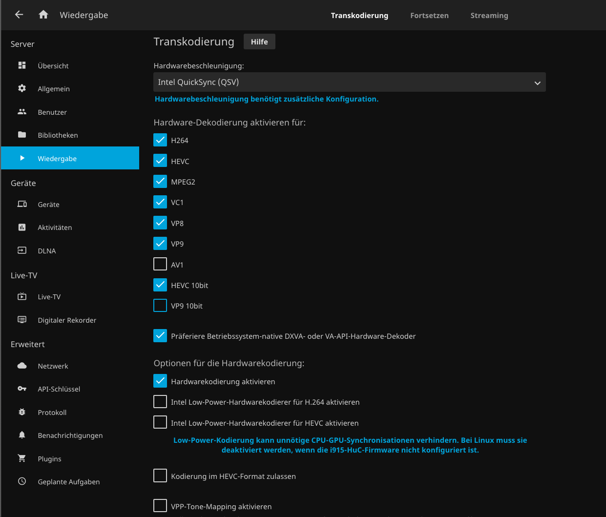

# Introduction
I'm using [Jellyfin](https://jellyfin.org/) as Media Center on my my Synology DS218+. It's running inside a docker container and I wanted to use the full hardware acceleration of the NAS. Synology [stopped supporting it's own media center called Video Station](https://www.heise.de/en/news/Synology-Video-Station-is-no-longer-available-9869607.html) solution with the latest OS update and I think Jellyfin is a good replacement.

# Setup Docker container
This is the docker compose setup I'm currently using:

```yaml
version: "3.9"
services:
  jellyfin:
    image: jellyfin/jellyfin:latest
    container_name: jellyfin
    restart: unless-stopped
    volumes:
      - /volume1/docker/jellyfin/config:/config
      - /volume1/docker/jellyfin/cache:/cache
      - /volume1/Media:/media
    user: 1026:100
    group_add:
      - "0"
      - "937"
    devices:
      - /dev/dri:/dev/dri
```

Take note of the `devices` section. this is required for passing the necessary hardware resource to the docker container. I've also setup the same user id and group id as my NAS user to avoid having troubles with access permissions and to run the container rootless.

Some instructions suggest to forward directly the device links under `/dev/dri` but by mapping the folder you can skip this part. Here's an example docker compose config:

```yaml
devices:
      - /dev/dri/renderD128:/dev/dri/renderD128
      - /dev/dri/card0:/dev/dri/card0
```

Regardless of this the permissions to these devices are [limited to root](https://adminkb.com/install-jellyfin-synology-docker-hardware-transcoding/) on Synology devices:

```bash
ls -al /dev/dri
total 0
drwxr-xr-x  2 root root              80 Nov 28 21:20 .
drwxr-xr-x 15 root root           14000 Nov 28 21:25 ..
crw-------  1 root root        226,   0 Nov 28 21:20 card0
crw-rw----  1 root videodriver 226, 128 Nov 28 21:20 renderD128
```

You can either decide to run the container as root or you can extend access to these devices by broading the access rights to `/dev/dri` to `777`.


## Configuring Hardware accelereration
Once you've got Jellyfin setup, you should go to the server settings, Playback, Trancoding. I've selected these options for my Intel based NAS:



The screenshot shows the German settings, but it should be applicable for all other languages as well.

## Testing
According to the [documentation](https://jellyfin.org/docs/general/server/transcoding/) there are four levels of transcoding with increasing requirements on the hardware. I've tested several files I've had lying around and was able to open most of them without problems. One bigger, newer file was unable to be opened unless I've configured the permissions more permissive on the video devices and restarted the container. Afterwards I was able to play that video, but had still high CPU loads., but for a 4K HDR video it was transcoding fine on the highest settings with more than 24 frames per second, so I'm considering this a successful configuration. Here's a [page with some examples](https://kodi.wiki/view/Samples) to download.

You can check the status of your video in either the video player window (by clicking on the settings icon, then playback information) or by opening a second browser window to Jellyfin and by checking the playback information of the current active sessions.

# Conclusion
What started as just documenting my used settings ended in a review of all my previous work for Jellyfin and updated my setup to the latest. I'm able to use the hardware acceleration but I won't be surprised if I hit some limits in the future. For now it's running fine with sufficient performance though.