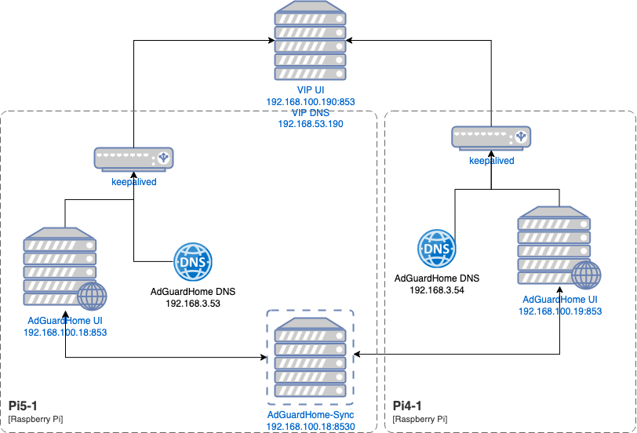

# Introduction
I've used to run Pi-Hole at home, changed then to AdGuardHome, then to AdGuardHome DNS and today I'm back again at at combination of AdGuardHome and AdGuardHome DNS as my primary DNS services at home. The reason for this is I finally found a solution to keep two AdGuardHome installations in sync and also keeping them highly available. Today I want to document how I did that.


# Installation
I'm using two Raspberry Pis for this setup. A Pi 5 8GB and a Pi 4 2GB. The Pi 5 serves also as a docker host and therefore gets the job to sync between the AdGuardHome installations using AdGuardHome-sync. Here's a schema of the current setup:



I'll leave the installation and setup of AdGuardHome and refer to [the official documentation](https://github.com/AdguardTeam/AdGuardHome?tab=readme-ov-file#automated-install-linux-and-mac) for this part. [AdGuardHome-sync](https://github.com/bakito/adguardhome-sync) is running as a docker container, using the two IPs of the AdGuardHome UIs (192.168.100.18 and 192.168.100.19).
I'm running Raspbian on my Raspberry Pis and had to install for keeaplived only two packages, using `sudo apt-get install keepalived libipset13`. For the healthcheck I'm using netcat, which I've installed using `sudo apt-get install netcat-openbsd`.

# Configuration
The configuration consists of several parts working together.

## Health check
On each of the two machines two scripts have to be added as `/usr/local/bin/check_adguard.sh`. These scripts act as a health script that keepalived uses to detect the availablity of the service.

On pi5-1:
```bash
#!/bin/bash
UI_URL="http://192.168.100.18:853/"
DNS_TEST="192.168.3.53"
DNS_TEST_v6="fdd6:e6df:9a26:3::53"

# 1. Check UI
if ! curl -fs --max-time 2 "$UI_URL" > /dev/null; then
    echo "AdGuardHome UI on Port 853 not reachable"
    exit 1
fi

# 2. Check DNS IPv4
if ! nc -zu -w2 "$DNS_TEST" 53 > /dev/null 2>&1; then
    echo "AdGuardHome DNS IPv4 not responding"
    exit 1
fi

# 3. Check DNS IPv6
if ! nc -6zu -w2 "$DNS_TEST_v6" 53 > /dev/null 2>&1; then
    echo "AdGuardHome DNS IPv6 not responding"
    exit 1
fi

exit 0
```

On pi4-1:
```bash
#!/bin/bash
UI_URL="http://192.168.100.19:853/"
DNS_TEST="192.168.3.54"
DNS_TEST_v6="fdd6:e6df:9a26:3::54"

# 1. Check UI
if ! curl -fs --max-time 2 "$UI_URL" > /dev/null; then
    echo "AdGuardHome UI on Port 853 not reachable"
    exit 1
fi

# 2. Check DNS IPv4
if ! nc -zu -w2 "$DNS_TEST" 53 > /dev/null 2>&1; then
    echo "AdGuardHome DNS IPv4 not responding"
    exit 1
fi

# 3. Check DNS IPv6
if ! nc -6zu -w2 "$DNS_TEST_v6" 53 > /dev/null 2>&1; then
    echo "AdGuardHome DNS IPv6 not responding"
    exit 1
fi

exit 0
```

Make the script executable on both machines using `sudo chmod +x /usr/local/bin/check_adguard.sh`.

Please note that I'm also checking the IPv6 connectivity. Reason for using netcat instead of e.g. dig is, that dig would cause frequent entries in AdGuardHome log, which annoyed me a lot. dig will provice the reliable results though, since you're doing DNS requests and can verify it is really working. It is even possible to create filter rules to avoid these requests showing up in your logs and statistics, but then I'm also excluding other local requests to the DNS so I'm ok with using netcat instead.

## keepalived configuration
Now we'll have to add the configuration for keepalived.

On pi5-1:
```bash
global_defs {
    script_user root
    enable_script_security
}

vrrp_script chk_adguard {
    script "/usr/local/bin/check_adguard.sh"
    interval 5
    weight -20
}

vrrp_instance VI_DNS {
    state MASTER
    interface eth0.3
    virtual_router_id 51
    priority 100
    advert_int 1
    authentication {
        auth_type PASS
        auth_pass WENyvutQ
    }
    virtual_ipaddress {
        192.168.3.190/24
    }
    virtual_ipaddress {
        fdd6:e6df:9a26:3:0:0:0:190/64
    }
    track_script {
        chk_adguard
    }
}

vrrp_instance VI_UI {
    state MASTER
    interface eth0
    virtual_router_id 52
    priority 100
    advert_int 1
    authentication {
        auth_type PASS
        auth_pass WENyvutQ
    }
    virtual_ipaddress {
        192.168.100.190/24
    }
    track_script {
        chk_adguard
    }
}
```

On pi4-1:
```bash
global_defs {
    script_user root
    enable_script_security
}

vrrp_script chk_adguard {
    script "/usr/local/bin/check_adguard.sh"
    interval 5
    weight -20
}

vrrp_instance VI_DNS {
    state MASTER
    interface eth0.3
    virtual_router_id 51
    priority 90
    advert_int 1
    authentication {
        auth_type PASS
        auth_pass WENyvutQ
    }
    virtual_ipaddress {
        192.168.3.190/24
    }
    virtual_ipaddress {
        fdd6:e6df:9a26:3:0:0:0:190/64
    }
    track_script {
        chk_adguard
    }
}

vrrp_instance VI_UI {
    state MASTER
    interface eth0
    virtual_router_id 52
    priority 90
    advert_int 1
    authentication {
        auth_type PASS
        auth_pass WENyvutQ
    }
    virtual_ipaddress {
        192.168.100.190/24
    }
    track_script {
        chk_adguard
    }
}
```

It is important to put the block for the check `vrrp_script chk_adguard` in the front of the actual configuration, otherwise keepalived will complain and won't find it. The `auth_pass` should not exceed 8 characters and shouldn't be too complex. I've documented here only a randomly created password. You should change it to your needs.

The priority of the pi4-1 is set to 90, so by default this is the secondary instance.

Now restart the keepalived service using `sudo systemctl restart keepalived.service` on both machines. You can check the current state using `sudo systemctl status keepalived.service` so you'll see who is primary and who is secondary. The instance with the highest weight is the primary, and the health script reduces the weight by minus 20 if there's somekind of error.

## AdGuardHome
I've had to change the `/opt/AdGuardHome/AdGuardHome.yaml` to bind the process to all available IPs, otherwise the process isn't able to bound to the Virtual IP (VIP) 192.168.100.190 and 192.168.3.190. The relevant parts are:

```yaml
http:
  address: 0.0.0.0:853
dns:
  bind_hosts:
    - 0.0.0.0
  port: 53
```

Do a restart of AdGuardHome after this, using `sudo systemctl restart AdGuardHome.service` on both machines.

## Router
Check if you're able to login to AdGuardHome on the VIP for the UI, e.g. http://192.168.100.190:853. If that is working, try to query the DNS under it's VIP, e.g.:

```bash
dig google.com @192.168.3.190

; <<>> DiG 9.10.6 <<>> google.com @192.168.3.190
;; global options: +cmd
;; Got answer:
;; ->>HEADER<<- opcode: QUERY, status: NOERROR, id: 37929
;; flags: qr rd ra; QUERY: 1, ANSWER: 1, AUTHORITY: 0, ADDITIONAL: 1

;; OPT PSEUDOSECTION:
; EDNS: version: 0, flags:; udp: 4096
;; QUESTION SECTION:
;google.com.			IN	A

;; ANSWER SECTION:
google.com.		37	IN	A	142.250.179.142

;; Query time: 36 msec
;; SERVER: 192.168.3.190#53(192.168.3.190)
;; WHEN: Sun Oct 05 08:33:24 CEST 2025
;; MSG SIZE  rcvd: 55
```

# Problems with IPv6
At first, IPv6 wasn't working for me. What helped was to set the IPv6 address into a separate block like this:

```bash
virtual_ipaddress {
        fdd6:e6df:9a26:3:0:0:0:190/64
    }
```

and suddenly I also got that IPv6 address for DNS requests:

```bash
dig -6 www.google.com fdd6:e6df:9a26:3:0:0:0:190

; <<>> DiG 9.10.6 <<>> -6 www.google.com fdd6:e6df:9a26:3:0:0:0:190
;; global options: +cmd
;; Got answer:
;; ->>HEADER<<- opcode: QUERY, status: NOERROR, id: 55029
;; flags: qr rd ra; QUERY: 1, ANSWER: 1, AUTHORITY: 0, ADDITIONAL: 1

;; OPT PSEUDOSECTION:
; EDNS: version: 0, flags:; udp: 4096
;; QUESTION SECTION:
;www.google.com.			IN	A

;; ANSWER SECTION:
www.google.com.		54	IN	A	172.217.23.196

;; Query time: 38 msec
;; SERVER: fdd6:e6df:9a26:3::190#53(fdd6:e6df:9a26:3::190)
;; WHEN: Mon Oct 06 18:39:04 CEST 2025
;; MSG SIZE  rcvd: 59

;; Got answer:
;; ->>HEADER<<- opcode: QUERY, status: NOERROR, id: 13187
;; flags: qr rd ra; QUERY: 1, ANSWER: 1, AUTHORITY: 0, ADDITIONAL: 0

;; QUESTION SECTION:
;fdd6:e6df:9a26:3:0:0:0:190.	IN	A

;; ANSWER SECTION:
fdd6:e6df:9a26:3:0:0:0:190. 3600 IN	A	0.0.0.0

;; Query time: 7 msec
;; SERVER: fdd6:e6df:9a26:3::190#53(fdd6:e6df:9a26:3::190)
;; WHEN: Mon Oct 06 18:39:04 CEST 2025
;; MSG SIZE  rcvd: 60
```

# Conclusion
It was quite simple to get this configuration running and I'm happy that the fallback works this good. I don't have to fear system restarts that block my complete network until completed startup and at the same time I'm having more control over the DNS requests in my home network.
With the help of this setup I was able to identify:
 * Tasmota devices can be configured to use a local ntp server instead of making requests to the outside
 * My Feinstaubsensor is unable to change it's ntp server
 * many requests are now cached and doesn't rely that much on external requests, speeding up page loading